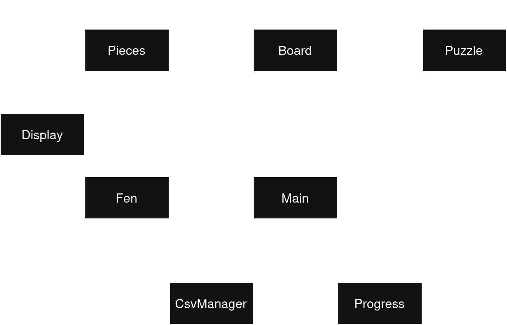

# Chess Puzzle Trainer Architecture

## Overview
A chess puzzle trainer implemented in Effekt, using algebraic effects for error handling and game state management.

## Core Modules

### Main (`src/main.effekt`)
- Application entry point
- Game flow coordination
- Settings management
- User interaction

### Puzzle (`src/puzzle.effekt`)
- Puzzle logic and validation
- Solution checking
- Game state tracking

### Board (`src/board.effekt`)
- Chess board representation
- Move execution
- Board state management

### Pieces (`src/pieces.effekt`)
- Piece definitions and properties
- Move pattern validation

### Simple UML how they interact:

## Support Modules

### FEN Parser (`src/fen.effekt`)
- FEN notation parsing
- Board state serialization

### CSV Manager (`src/csvmanager.effekt`)
- Puzzle database operations
- Puzzle selection logic

### Progress System (`src/progress.effekt`)
- Player progress tracking
- Difficulty unlocking
- Progress persistence

### Display (`src/display.effekt`)
- ASCII board rendering
- UI elements
- Terminal formatting

## Data Flow
1. Main → Load puzzles/progress
2. User → Select difficulty
3. CSV Manager → Provide puzzle
4. FEN Parser → Create board
5. Display → Show board
6. Puzzle → Validate moves
7. Progress → Track/save results

## Effect System
- `InvalidMove`: Move validation
- `InvalidPuzzle`: Puzzle loading
- `PuzzleWon`/`PuzzleLost`: Game outcomes
- `IOError`: File operations
- `OutOfBounds`: Array safety

## Dependencies
- Lichess puzzle database (CC0 license)
- Effekt standard library
  - string
  - option
  - list
  - io